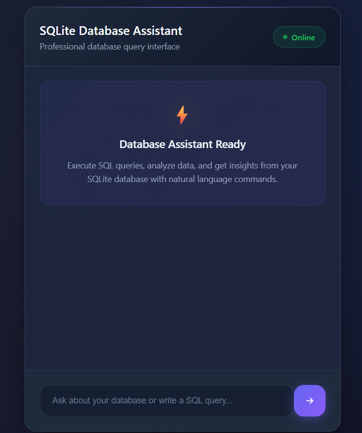

# Chat-Assistance-for-SQLite-databse
<p align="center">
  
</p>
## Overview
This Flask-based chatbot allows users to query an SQLite database containing employee and department information. It can process predefined SQL queries for specific requests and use the Llama3.2:1B model via Ollama for more complex queries.

## Features
- Handles predefined queries for:
  - Listing all employees in a department.
  - Finding the manager of a department.
  - Listing employees hired after a given date.
  - Calculating total salary expenses for a department.
- Uses Ollama's Llama3.2:1B model to generate SQL queries for unrecognized inputs.
- Provides a simple web-based interface for user interaction.

## How It Works
1. The user enters a query in the chatbot interface.
2. The Flask app checks if the query matches predefined SQL patterns.
3. If a match is found, the corresponding SQL query is executed on `company.db`.
4. If no match is found, the request is sent to Ollama's Llama3.2:1B model to generate an SQL query.
5. The SQL query is executed (if valid), and the result is returned to the user.
6. If the query is not related to employees, departments, managers, salaries, or hiring dates, the assistant responds that it cannot process the request.

## Running the Project Locally
### Prerequisites
- Python 3.x
- Flask
- SQLite3
- Ollama with the Llama3.2:1B model

### Setup Steps
1. Clone this repository:
   ```bash
   git clone https://github.com/your-repo/chatbot-flask.git
   cd chatbot-flask
   ```
2. Install dependencies:
   ```bash
   pip install flask sqlite3 ollama
   ```
  2.1 Download Ollama
  ```bash
  Windows
  https://ollama.com/download/windows
  Linux
  curl -fsSL https://ollama.com/install.sh | sh
  ```
  2.2 Run 
  ```bash
  ollama pull llama3.2:1b
  ollama run llama3.2:1b
  ```

3. Ensure you have an SQLite database (`company.db`) with the required tables:
   ```sql
   CREATE TABLE Employees (
       ID INTEGER PRIMARY KEY,
       Name TEXT,
       Department TEXT,
       Hire_Date TEXT,
       Salary INTEGER
   );

   CREATE TABLE Departments (
       ID INTEGER PRIMARY KEY,
       Name TEXT,
       Manager TEXT
   );
   ```
4. Start the Flask application:
   ```bash
   python app.py
   ```
5. Open your browser and go to `http://127.0.0.1:5000/`.

## API Endpoints
### `GET /`
Renders the main chatbot interface.

### `POST /chat`
Processes user input and returns a chatbot response.
- **Request Body:**
  ```json
  { "message": "Show me all employees in Sales" }
  ```
- **Response:**
  ```json
  { "response": [["Alice"], ["Bob"]] }
  ```

## Known Limitations & Suggestions for Improvement
- **Database Dependency:** The chatbot relies on `company.db`. Ensure it is correctly populated before use.
- **Limited Query Recognition:** The predefined patterns handle only specific query structures. Expanding these patterns would improve accuracy.
- **Ollama SQL Generation:** While effective, Ollama-generated SQL might sometimes require validation before execution.
- **Enhanced Natural Language Understanding:** Integrating a more advanced NLP model could improve query interpretation.
- **Security Considerations:** Adding user authentication and SQL injection protection would enhance security.
